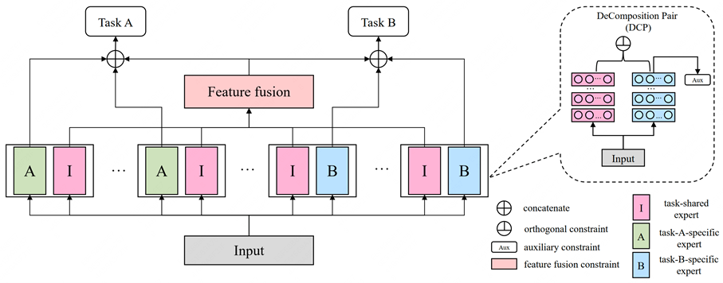

# Feature Decomposition for Reducing Negative Transfer: a Novel Multi-task Learning Model for Recommender System

## model architecture


## Bibtex:
```sh
@article{zhou2023feature,
  title={Feature Decomposition for Reducing Negative Transfer: A Novel Multi-task Learning Method for Recommender System},
  author={Zhou, Jie and Yu, Qian and Luo, Chuan and Zhang, Jing},
  year={2023},
}
```

## Project structure
```
├── code
    ├── aliccp
        ├── FDN.py
        ├── MMoE.py
        ├── PLE.py
        ├── run.sh
    ├── synthetic_dataset
        ├── FDN.py
        ├── MMoE.py
        ├── PLE.py
        ├── run.sh
├── data 
    ├── aliccp
        ├── train_data
            ├── train_data.csv
        ├── test_data
            ├── test_data.csv
        ├── vocab
            ├── ID feature index files
        ├── reader.py
    ├── synthetic_dataset
        ├── train_data
        ├── test_data
        ├── synthesis_dataset_generation.py
├── README.md
```

## Quick start
### [Ali-CCP: Alibaba Click and Conversion Prediction](https://tianchi.aliyun.com/dataset/dataDetail?dataId=408)
```bash
cd code/aliccp
sh run.sh
```
### Synthetic DataSet 
```bash
cd code/synthetic_dataset
sh run.sh
```

# Acknowledgement
 - The work is also supported by the National Natural Science Foundation of China (No. 62202025 and 62002012).
